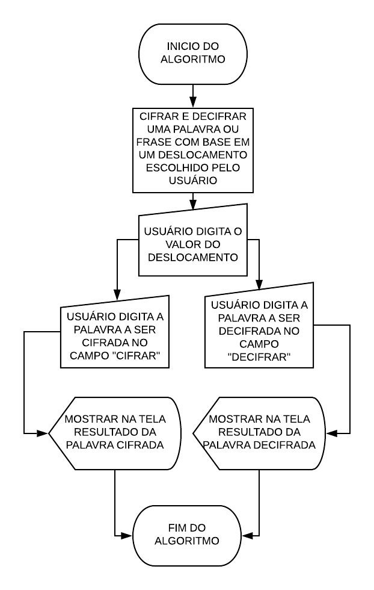

## PROJETO CYPHER <h2>

Neste projeto foi desenvolvida uma página web, com base na Cifra de César, dispondo ao usuário um input de deslocamento, um input para o usuário inserir uma palavra ou frase a ser cifrada, e um input para inserir uma palavra ou frase a ser decifrada. 
O deslocamento é feito em base na escolha do usuário, sendo permitido cifrar letras minúsculas e maiúsculas, e mantendo números, letras craseadas, espaços e caracteres especiais, como "@#$%&" e etc. 

Link do trello utilizado para organização das tarefas. <https://trello.com/b/XEqBQ53Y/cypher>

